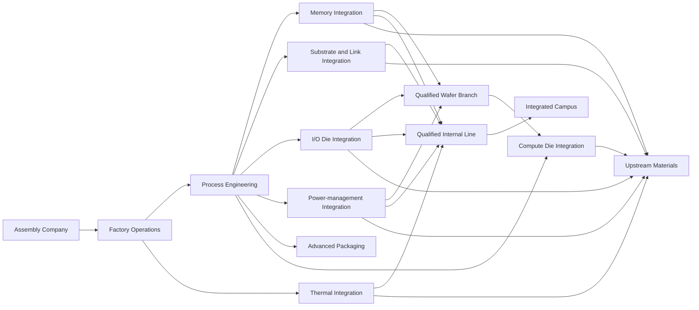

# Machine and capability progression

**Status:** First-pass progression framework for iteration. Machine names, recipes, costs, and ordering remain provisional.

This document describes how Chip City can begin with purchased components and progressively unlock internal production. See [Game design](game-design.md) for the overall loop, [Factory machines](factory-machines.md) for machine roles, [Component catalog](component-catalog.md) for component specifications, and [Manufacturing metrics](manufacturing-metrics.md) for production calculations.

## Progression goal

The player should begin as an assembly company, not as the owner of an entire semiconductor supply chain.

At the start:

- finished component modules are available from suppliers;
- the player designs final chips and builds assembly factories;
- supplier prices, quality, capacity, and reliability create meaningful constraints;
- no internal component branch is required to ship a viable first product.

Over time, the player can integrate backward into selected component families. Internal production may lower cost, improve quality, increase supply security, or unlock proprietary components, but it also adds capital, factory space, process risk, rejects, and logistical dependencies.

The progression system must preserve **buy, make, or combine** as a continuing strategic choice. Unlocking production never removes the corresponding supplier market.

## First-release scope

The first complete game should use one expandable factory campus rather than multiple independently simulated sites.

Campus progression includes:

- purchasing additional floor parcels;
- adding specialized clean or industrial production zones;
- expanding receiving, storage, utility, inspection, and test capacity;
- building internal component departments that feed shared final assembly;
- merging purchased and internal versions of compatible components.

The first-release internal-production branches are:

1. thermal components;
2. memory;
3. substrates and interconnects.

I/O, power-management, and compute remain purchasable but are not internally producible in the proposed first release. Their branches remain in the capability map as expansion directions. Advanced packaging remains in scope because it deepens final-chip assembly without adding another complete component-fabrication chain.

Multiple sites, inter-factory freight, upstream raw-material production, and internally fabricated I/O, power, or compute are deferred until the one-campus game proves fun and legible.

## Recommended progression model

Use a **capability map** rather than a single linear research tree.

- A shared **factory infrastructure spine** unlocks tools useful across many products.
- Separate **component branches** unlock internal production. Thermal, memory, and substrates/links form the proposed first-release set; I/O, power, and compute show later expansion space.
- **Advanced packaging and quality** branches unlock products that require new manufacturing capabilities.
- Optional **upstream materials** branches deepen vertical integration late in the game.

Advanced Packaging remains reachable by a company that purchases every component die. Compute production requires Process Engineering plus evidence from any qualified wafer-production branch, not a particular component family. Integrated Campus capabilities become relevant after at least one internal line serves multiple final products.

This is not a mandatory sequence for every branch. Prerequisites express shared capabilities while leaving room for different company strategies.

## Three parts of an unlock

An unlock should not instantly make an advanced component available at full efficiency.

### 1. Develop the capability

The player completes an engineering project using cash, time, and evidence from existing production. This unlocks:

- relevant machine models in the equipment catalog;
- starter recipes;
- planning estimates for the new production process.

### 2. Purchase and build

Unlocked machines still require capital, floor space, logistics, and supporting equipment. Research grants permission and knowledge, not a free factory.

### 3. Qualify the output

The player runs a pilot batch and produces enough accepted samples to qualify the internal component for use in final products or external sale.

Qualification can require:

- a sample quantity;
- minimum measured quality or yield;
- passing the relevant inspection and test capabilities;
- delivery of engineering samples to a customer or standards body.

Before qualification, experimental output may still be inspected, scrapped, or used in low-risk internal prototypes.

## Unlock currencies and requirements

Avoid a passive research-point bar disconnected from factory play. Engineering projects should use a small set of understandable requirements:

| Requirement | Purpose |
| --- | --- |
| Cash investment | Makes research compete with capacity expansion and inventory |
| Engineering capacity | Limits how many major projects can run simultaneously |
| Production evidence | Requires the player to experience the problem before unlocking its solution; orders, spend, shortages, and unmet demand can all count |
| Qualified samples | Turns a research unlock into a factory-building challenge |
| Optional supplier license | Provides a faster but more expensive path into some technologies |

Example:

> **Develop internal 1 GB memory** requires $40,000, one available engineering team, and evidence of demand for 5,000 MD-110 units through purchases, supplier orders, or unfilled production demand. Completion unlocks the Memory Fabrication Cell, Wafer Scanner memory recipe, Dicing Station, and Memory Tester. Producing 200 qualified MD-110 dies certifies internal memory for normal production.

Exact values are balance placeholders. The structure is more important than the numbers.

## Shared infrastructure spine

These capabilities support all component branches and prevent each branch from becoming an isolated chain.

### Stage 0: Assembly operations

Available at the beginning.

| Machine or tool | Role |
| --- | --- |
| Delivery Dock (`RCV-100`) | Receives purchased typed components and materials |
| Conveyor (`LOG-100`) | Moves one item stream between machines |
| Component Storage (`BUF-100`) | Buffers one configured item type |
| Chip Assembler (`ASM-100`) | Places chiplets and dies on a substrate |
| Connection Station (`BND-100`) | Creates die-to-die links |
| Quality Scanner (`INS-100`) | Finds visible placement and connection defects |
| Chip Tester (`TST-100`) | Runs electrical and thermal validation |
| Packaging Station (`PKG-100`) | Completes the final package |
| Scrap Collector (`SCR-100`) | Receives rejected items |
| Shipping Dock (`SHP-100`) | Ships accepted products |

This set supports a complete company using purchased component modules.

### Stage 1: Factory operations

Unlocked through successful assembly production.

| Unlock | New decision |
| --- | --- |
| Conveyor Splitter and Merger (`LOG-110`) | Share inputs and outputs among parallel machines |
| Item Filter (`LOG-120`) | Route typed items on configurable paths |
| Priority Router (`LOG-130`) | Prefer contracts or production lines when supply is constrained |
| Multi-item Warehouse (`BUF-120`) | Trade compact storage for more complex inventory management |
| Production Monitor (`CTL-100`) | View utilization, starvation, blocking, cost, and route demand |
| Supplier Receiving Scheduler (`RCV-120`) | Control delivery cadence and dock allocation |

This stage makes larger factories readable and prepares the player for mixed purchased and internal supply.

### Stage 2: Process engineering

Unlocked after the player has experienced rejects and bottlenecks.

| Machine or capability | New decision |
| --- | --- |
| Wafer Scanner (`WIS-100`) | Inspects component wafers before expensive downstream work |
| Dicing Station (`DIC-100`) | Separates processed wafers into individual dies |
| Die Tester (`DTS-100`) | Qualifies component dies before final assembly |
| Rework Bench (`RWK-100`) | Recovers selected failure types at added time and cost |
| Material Recovery Unit (`REC-100`) | Reclaims a fraction of eligible reject materials |
| Recipe Control (`CTL-120`) | Chooses speed, quality, and operating-cost process modes |

These are common prerequisites for internal semiconductor-component branches.

### Stage 3: Integrated campus

Unlocked after one qualified internal component line serves multiple final products.

| Capability | New decision |
| --- | --- |
| Campus Distribution Warehouse (`BUF-200`) | Allocates shared components among several consumers |
| Production Contracts | Reserves internal capacity for a product or external buyer |
| Supplier Backup Rules | Automatically supplements short internal supply |
| Central Quality Lab (`LAB-200`) | Shares advanced qualification capacity across product families |

This stage turns component departments into a reusable campus network rather than dedicated appendages.

### Later: Multi-site production

Inter-factory Freight Docks (`FRT-100`), distribution between sites, and regional supplier networks are deferred expansion capabilities. They should extend the campus allocation rules rather than introduce a separate economic model.

## Component-production branches

### Memory branch

Memory is the recommended first **wafer-production branch** because it is easy to explain economically, has high reusable volume, and can feed many final products. Thermal production can precede it as a lower-risk introduction to vertical integration.

#### Memory 1: Licensed memory production

**Prerequisite:** Process Engineering.

| Machine | Input | Output | Factory character |
| --- | --- | --- | --- |
| Memory Fabrication Cell (`MEM-100`) | Blank silicon wafer, process chemicals, MD-110 mask/license | Processed memory wafer | Batch production with variable wafer yield |
| Wafer Scanner (`WIS-100`) | Processed memory wafer | Mapped memory wafer or reject | Identifies bad regions before dicing |
| Dicing Station (`DIC-100`) | Mapped memory wafer | Unqualified MD-110 dies | High-volume output in batches |
| Memory Tester (`MTS-100`) | Unqualified memory dies | Qualified MD-110 dies or rejects | Bins output by quality and speed |

The branch initially produces 1 GB LPDDR Memory (`MD-110`). Purchased MD-110 remains compatible and can merge with internal output.

#### Memory 2: High-density memory

Unlocks:

- MD-130 recipe support;
- Advanced Memory Tester (`MTS-200`);
- better process-control recipes;
- denser wafers with higher value but greater defect sensitivity.

The player chooses between upgrading existing capacity, dedicating a high-quality line, or continuing to purchase premium memory.

#### Memory 3: Proprietary memory

Unlocks internally developed MD-210-class designs and process tuning. This is the point where integration creates product capability unavailable from ordinary suppliers, not just cost savings.

The new factory decision is whether to reserve scarce proprietary output for premium internal products, sell it externally, or expand a capital-intensive line before demand is proven.

### Substrate and interconnect branch

This branch supports lower material cost, advanced package layouts, and wider links. It is characterized by sheet or panel batches that are patterned and cut into several product sizes, creating nesting, offcut, and batch-allocation decisions.

#### Substrate 1: Package substrates

| Machine | Role |
| --- | --- |
| Lamination Press (`SUB-100`) | Combines substrate layers |
| Trace Patterning Station (`TRC-100`) | Creates package routing |
| Substrate Inspector (`SIS-100`) | Rejects warped or misrouted substrates |
| Substrate Cutter (`CUT-100`) | Produces final package substrates |

#### Interconnect 1: Standard connection kits

| Machine | Role |
| --- | --- |
| Conductor Former (`LNK-100`) | Produces standard link material |
| Link Finishing Station (`LNF-100`) | Creates assembly-ready connection kits |
| Continuity Tester (`LNT-100`) | Qualifies link kits |

#### Interconnect 2: Wide and dense links

Unlocks DL-130 production, finer substrate routing, advanced bonding recipes, and X-ray inspection requirements.

The new factory decision is whether dense products receive dedicated X-ray capacity or compete with final packages for shared advanced inspection. This branch should improve both unit cost and the set of package layouts the company can manufacture reliably.

### Thermal branch

This is a comparatively accessible mechanical-production branch with bulky material flow.

**Prerequisite:** Factory Operations. Thermal integration does not require semiconductor wafer-processing knowledge and can be the player's first low-risk make-versus-buy experiment.

#### Thermal 1: Heat spreaders

| Machine | Role |
| --- | --- |
| Metal Former (`THM-100`) | Shapes thermal blanks |
| Surface Finisher (`THF-100`) | Creates flat, assembly-ready surfaces |
| Thermal Tester (`THT-100`) | Measures thermal capacity and rejects weak parts |

#### Thermal 2: Advanced cooling

Unlocks vapor-chamber components (`TH-130`), additional material inputs, leak testing, and higher packaging capability.

The new factory decision is whether to dedicate a leak-tested line to advanced cooling or mix basic and advanced thermal products through shared forming capacity. The branch offers lower technical risk than semiconductor fabrication but creates transport-volume and storage pressure.

### I/O branch

I/O combines shared wafer-processing knowledge with specialized testing and package-edge requirements.

#### I/O 1: Licensed display controller

| Machine | Role |
| --- | --- |
| Logic Fabrication Cell (`LOGC-100`) | Produces licensed IO-110 wafers |
| Mask and Recipe Loader (`MSK-100`) | Changes the configured I/O product at a setup-time and material cost |
| Wafer Scanner (`WIS-100`) | Maps visible wafer defects |
| Dicing Station (`DIC-100`) | Separates I/O dies |
| Interface Tester (`IFT-100`) | Tests display and external-link functions |

#### I/O 2: Configurable interfaces

Unlocks networking, storage, sensor, or dual-display recipes. I/O production is characterized by many lower-volume products sharing fabrication equipment. Recipe changeovers consume time and mask material, while each interface family requires a compatible test fixture.

The new factory decision is whether to run larger efficient batches into inventory, accept frequent changeovers for responsiveness, or dedicate separate cells to important I/O families.

### Compute branch

Compute is a late, capital-intensive branch. It should not merely be memory production with larger numbers.

#### Compute 1: Licensed compute chiplets

**Prerequisites:** advanced process control, advanced metrology, and any one qualified wafer-production branch such as memory, I/O, or power management.

| Machine | Role |
| --- | --- |
| Precision Logic Fabricator (`CPU-100`) | Produces licensed CP-110 wafers at high operating cost |
| Advanced Metrology Station (`MET-200`) | Measures critical process variation |
| Dicing Station (`DIC-200`) | Handles expensive, larger compute dies |
| Compute Characterization Tester (`CPT-100`) | Bins dies by frequency, power, and quality |
| Stress Tester (`BRN-100`) | Runs burn-in cycles to qualify high-reliability output |

Compute wafers are expensive and low-volume. Binning should create useful lower-grade output rather than making every imperfect die pure scrap.

#### Compute 2: Advanced architectures

Unlocks CP-130 and later compute recipes, newer process generations, higher cleanroom requirements, and proprietary architecture research.

The new factory decision is how aggressively to bin valuable dies: strict bins create premium output but strand usable lower-grade inventory, while broad bins improve yield but may not satisfy advanced products.

### Power-management branch

Power controllers eventually separate from the starter prototype's combined cooling and power abstraction.

**Prerequisite:** Process Engineering.

| Machine | Role |
| --- | --- |
| Analog Fabrication Cell (`PWR-100`) | Produces power-management wafers |
| Analog Tester (`PAT-100`) | Measures efficiency, voltage behavior, and reliability |
| Power Die Packager (`PDP-100`) | Produces assembly-ready PM-series dies |

Power production emphasizes reliability and analog testing rather than maximum throughput.

Later power tiers introduce several voltage and efficiency classes. Shared analog fabrication favors long batches, while customer-specific qualification and burn-in favor flexible downstream test capacity.

## Advanced packaging and quality branch

This branch expands which final-chip designs can be manufactured, independent of who produced their component dies.

| Capability | Machines unlocked | Product effect |
| --- | --- | --- |
| Fine-pitch bonding | Precision Bonder (`BND-200`) | Supports wider and denser die-to-die links |
| Hidden-joint inspection | X-ray Scanner (`XRY-100`) | Qualifies dense substrates and advanced packages |
| High-reliability qualification | Stress Tester (`BRN-100`) | Satisfies reliability-sensitive opportunities |
| Multi-level packaging | Interposer Assembler (`INT-200`) | Supports larger multi-chip packages |
| 3D integration | Die Stacker (`STK-300`) | Enables vertically stacked memory or compute |
| Advanced thermal packaging | Vacuum Package Station (`PKG-200`) | Supports vapor chambers and high-power products |

These capabilities should unlock new contract categories and chip-design possibilities, not only improve existing statistics.

Advanced Packaging depends on assembly, process-control, and inspection knowledge, but not on internal production of memory, substrates, thermal parts, or other component families.

## Optional upstream-material branches

Upstream integration should be late and optional. It increases logistical scale dramatically and should not be required for players primarily interested in chip and factory optimization.

Possible branches:

- silicon ingot growth and wafer slicing;
- substrate resin, glass, and copper preparation;
- process-chemical production;
- thermal-metal refining and forming;
- packaging-material production.

The first full-game version can keep these as purchased materials while preserving room for later expansion.

## Machine generations

Research should unlock both new capabilities and alternative machine models. Avoid a universal `Machine I -> Machine II -> Machine III` ladder.

| Generation | Typical character |
| --- | --- |
| 100-series | Affordable, compact, modest throughput, limited recipes, small buffers |
| 200-series | Faster or more automated, larger footprint, higher power and capital cost, advanced recipes |
| 300-series | Specialized frontier capability, demanding infrastructure, high output value, difficult maintenance |

A later model should not always dominate:

- a compact 100-series machine may remain useful for prototypes or low-volume products;
- a 200-series machine may be efficient only near full utilization;
- a specialized 300-series machine may be required for one advanced capability but wasteful for basic products.

The same rule applies within component tiers:

- high-density memory may require a slower inspection route and force the player to separate basic and premium production;
- dense interconnects require X-ray inspection, creating a new shared-capacity decision;
- advanced thermal products add leak-test and material-handling stages;
- configurable I/O creates batch-size and recipe-changeover pressure;
- advanced compute increases the value of binning, rework, and early defect detection.

## Component production grammars

Every internal branch should differ on at least three of these gameplay dimensions:

| Dimension | Possible forms |
| --- | --- |
| Flow topology | Linear, branching, converging, recirculating |
| Process cadence | Continuous, batch, long setup run, low-volume precision |
| Quality model | Pass/fail, graded output, performance bins, repairable faults |
| Output shape | One output, several grades, byproducts, reusable offcuts |
| Changeover pressure | Dedicated recipe, flexible machine, costly product switch |
| Physical pressure | Bulk transport, cleanroom space, power, storage, special handling |
| Recovery options | Scrap, rework, rebinnig, recycling, lower-grade sale |

The first-release branches use deliberately different combinations:

| Branch | Topology and cadence | Quality and outputs | Primary physical pressure |
| --- | --- | --- | --- |
| Thermal | Continuous linear forming and finishing | Capacity grades and recyclable offcuts | Bulky material transport and storage |
| Memory | Batch wafer flow that fans out into many dies | Spatial wafer yield and speed/quality bins | Clean processing, parallel test, inventory by grade |
| Substrate / interconnect | Panel batches split among several package designs | Trace defects, continuity, offcuts, dense-link inspection | Panel allocation and shared X-ray capacity |
| Final assembly | Many component streams converge into one product | Inherited quality plus inspection/test rejects | Synchronization, starvation, and high work-in-progress value |

Future branches must add new grammars rather than repeat a first-release chain with different recipes:

- I/O emphasizes frequent recipe changeovers and interface-specific test fixtures.
- Power emphasizes long analog batches, reliability qualification, and burn-in.
- Compute emphasizes expensive low-volume wafers, early metrology, and performance binning.

## Candidate first campaign progression

This sequence is a teaching order, not the only viable long-term strategy.

| Step | Player situation | New capability | Intended lesson |
| --- | --- | --- | --- |
| 1. Purchased assembly | Buy every component and ship a basic display-controller package | Assembly Operations | Chip design creates factory demand |
| 2. Flow improvement | Supplier deliveries and queues limit output | Factory Operations | Routing, buffering, and capacity matter |
| 3. Quality pressure | Reject loss becomes economically visible | Process Engineering | Early inspection and testing protect expensive inputs |
| 4. Thermal pilot | Heat-spreader spending and freight volume justify simple integration | Thermal 1 | Internal production changes space and logistics |
| 5. Memory pilot | Memory spending justifies the first wafer line | Memory 1 | Batch yield trades simplicity for margin |
| 6. Hybrid supply | Internal memory cannot meet all demand | Supplier backup rules | Buy and make can coexist |
| 7. Package materials | Several products consume different substrates and links | Substrate / Interconnect 1 | Product mix, panel waste, and inspection interact |
| 8. Advanced product | A contract requires dense links or higher reliability | Advanced Packaging | New machines unlock new design space |
| 9. Integrated campus | Several internal departments feed multiple products | Campus distribution and allocation | Shared capacity creates leverage and contention |

## Progression presentation

The player-facing screen should present capabilities as an industrial development map. Proprietary internal components are an explicit exception to supplier compatibility: they are make-only products because no equivalent supplier item existed, not because research removed an existing supplier option.

Each node should show:

- what problem or opportunity motivates it;
- prerequisite capabilities;
- engineering-project requirements;
- machines and recipes unlocked;
- new input materials introduced;
- product families affected;
- estimated capital range for a useful line;
- qualification requirements;
- whether suppliers remain available.

When a node becomes relevant, the game should point to evidence from the player's company:

> You purchased $86,000 of MD-110 memory last quarter. At current volume, a qualified internal line could save an estimated $4-$7 per accepted final chip, but requires approximately $120,000 in equipment and introduces wafer-yield risk.

This makes progression a response to the player's industrial situation rather than an abstract list of bonuses.

## Design requirements

- The player can remain viable while purchasing any component family.
- Unlocking internal production never silently replaces supplier sourcing.
- Every component branch introduces a distinct factory problem.
- Shared machines and knowledge reduce duplication across branches.
- Research unlocks capability; capital and qualification make it operational.
- Early branches primarily improve cost, quality control, or supply security.
- Later branches may unlock proprietary product capabilities.
- New machine generations coexist with older models through footprint, utilization, capability, or cost tradeoffs.
- Progression should expand factory-network complexity gradually rather than exposing the entire production tree at once.

## Open questions for iteration

- Whether engineering projects consume dedicated staff, company time, physical lab capacity, or a combination.
- Which production milestones should unlock each optional branch.
- Whether licenses are permanent purchases, royalties per unit, or supplier partnerships.
- How detailed the first memory recipe should be before it becomes process simulation rather than factory gameplay.
- Whether process-generation research is shared by memory, I/O, power, and compute or developed separately.
- How machine power, cleanroom class, maintenance, and staffing enter the progression.
- Whether the proposed thermal, memory, and substrate/link scope contains enough strategic variety for the first complete release.
- How much upstream-material integration supports the fantasy before overwhelming the chip-company focus.
